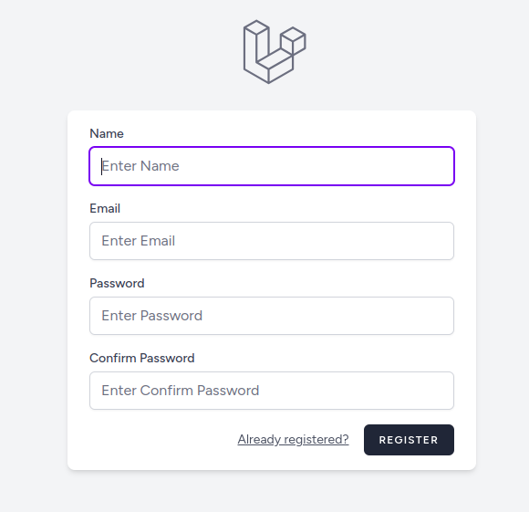

# Multi-Tenant SaaS (Laravel)

This is a minimal **Multi-Tenant SaaS** built with Laravel.  
Each user can create, manage, and switch between multiple companies under their profile.

---

## 🚀 Features
- User Authentication (Laravel Breeze/Fortify)
- Manage multiple companies per user
- Switch active company
- Scoped data per active company
- MySQL database with clean schema

---

## 📂 Database Structure
**users**
- id, name, email, password, active_company_id

**companies**
- id, user_id, name, address, industry, timestamps

---

### Authentication
- `POST /register` – Register new user
    
- `POST /login` – Login user
    
- `POST /logout` – Logout

### Companies
- `GET /companies` – List user’s companies
    
- `POST /companies` – Create company
    
- `PUT /companies/{id}` – Update company
    
- `DELETE /companies/{id}` – Delete company
- `POST /companies/{id}/switch` – Switch active company
    
---

## ⚙️ Setup Instructions
1. Clone repo:
   git clone https://github.com/sanjeevkumarjha123/multi-tenant.git  
   cd multi-tenant
2. Install Dependencies
   composer install
   npm install
3. Environment Setup

   Copy .env.example to .env:

   cp .env.example .env

   Update your .env file with correct values:

    APP_NAME="MultiTenant"
    APP_ENV=local
    APP_KEY=
    APP_DEBUG=true
    APP_URL=http://127.0.0.1:8000

    DB_CONNECTION=mysql
    DB_HOST=127.0.0.1
    DB_PORT=3306
    DB_DATABASE=your database name
    DB_USERNAME=root
    DB_PASSWORD=

5. Run Database Migrations
    php artisan migrate

6. Clear & Optimize Cache
    php artisan config:clear
    php artisan cache:clear
    php artisan route:clear
    php artisan view:clear
    php artisan optimize

7. Build Frontend Assets

    For development:

    npm run dev

    For production:

    npm run build

8. Serve the Application
    php artisan serve

    Visit: http://127.0.0.1:8000

